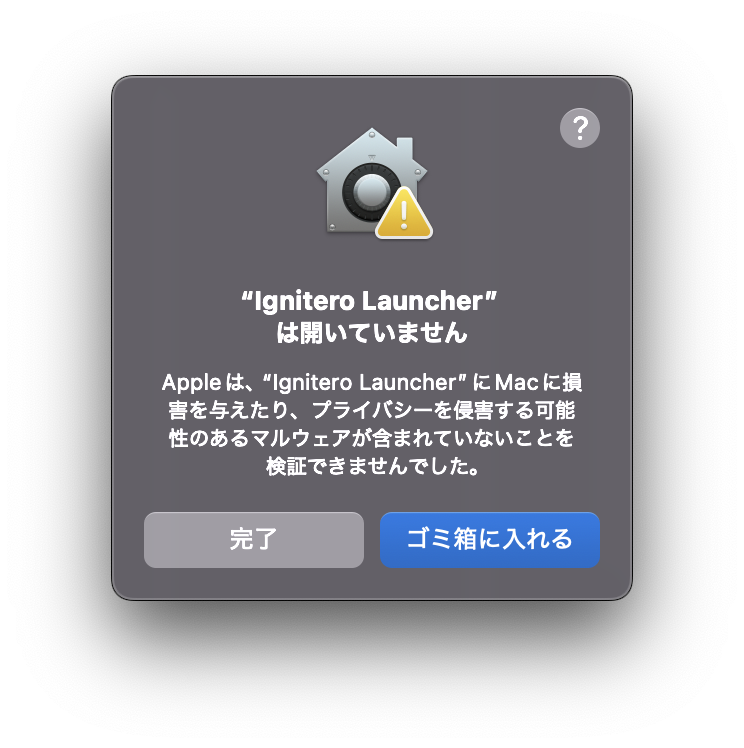
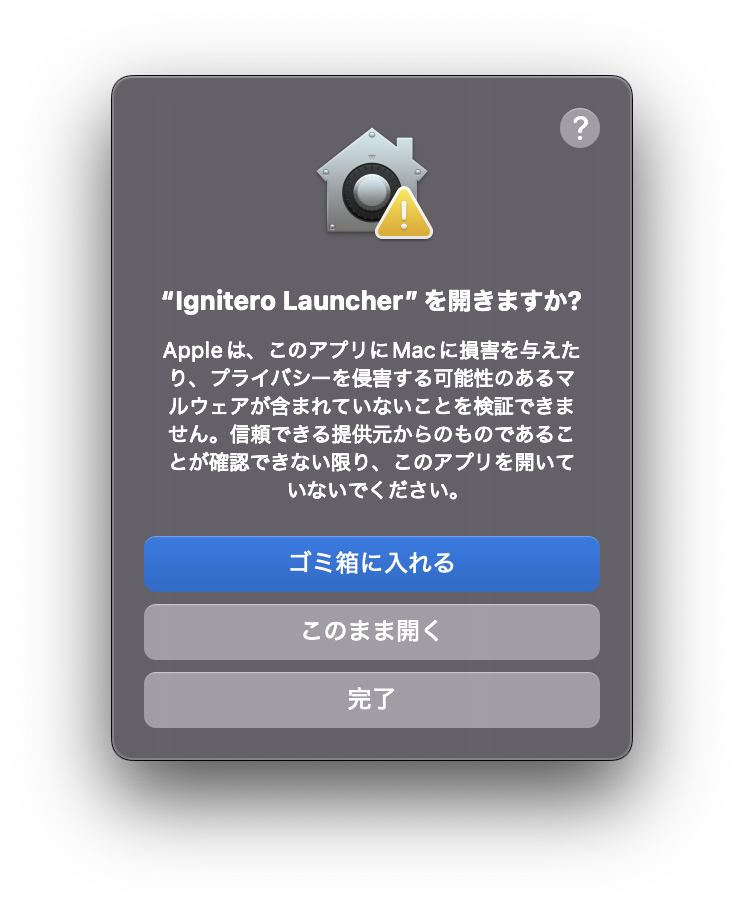

# Ignitero Launcher


macOS向けの高速アプリケーション・ディレクトリランチャー。Tauri v2で構築されたステータスバー常駐型のランチャーです。

## 特徴

- 🚀 **高速検索**: SQLiteキャッシュによる高速なインクリメンタル検索
- 🇯🇵 **日本語検索対応**: かな入力・ローマ字変換による最適化された日本語検索
- 🎯 **アプリケーション起動**: /Applications配下のアプリを素早く起動
- 📁 **柔軟なディレクトリ管理**: ディレクトリ自身や配下のディレクトリをFinder/エディタで開く
- 💻 **ターミナル統合**: →キーでディレクトリをターミナルで開く
- ⌨️ **グローバルホットキー**: `Option+Space`で検索窓を呼び出し
- 🔄 **自動キャッシュ更新**: 起動時・定期的な自動更新に対応
- 📌 **ステータスバー常駐**: バックグラウンドで常に利用可能

## 主な機能

### アプリケーション検索・起動
- `/Applications`配下のアプリケーションを自動スキャン
- 登録ディレクトリ配下の`.app`ファイルも検索対象に追加可能
- ファジーマッチングによる柔軟な検索
- **日本語検索対応**:
  - かな入力をローマ字に自動変換して検索
  - IME入力中の適切な制御
  - 日本語アプリ名の効率的な検索

### ディレクトリ管理
- **柔軟な設定**:
  - ディレクトリ自身の開き方を選択（表示しない / Finder / エディタ）
  - 配下のディレクトリの開き方を選択（表示しない / Finder / エディタ）
  - ディレクトリごとに異なるエディタを設定可能
  - カスタム検索キーワードで見つけやすく
- **対応エディタ**: Windsurf、Cursor、VS Code
- **ターミナル統合**: ディレクトリ選択時に→キーでターミナルを開く
  - 対応ターミナル: macOSターミナル、iTerm2、Warp

### キャッシュ管理
- SQLiteによる高速なキャッシュ
- 更新タイミングを細かく設定可能：
  - 起動時に更新
  - 自動更新（1〜24時間間隔で設定可能）
  - 手動更新（ステータスバーまたは設定画面から）

### UI/UX
- シンプルで直感的な検索インターフェース
- **キーボードナビゲーション**:
  - ↑↓キーで項目選択（選択項目を自動スクロール）
  - Enterで起動
  - →キーでディレクトリをターミナルで開く
  - Escapeで閉じる
- `Option+Space`で即座にアクセス
- macOS標準のぼかし効果（window-vibrancy）
- ツールチップ付きアイコンボタン（キャッシュ更新・設定）

## 必要要件

- macOS 10.15以降
- Node.js 18以降
- Rust 1.70以降
- pnpm

## インストール

### 開発環境での実行

```bash
# リポジトリをクローン
git clone https://github.com/owayo/ignitero-launcher.git
cd ignitero-launcher

# 依存関係をインストール
pnpm install

# 開発モードで実行
pnpm tauri dev
```

### プロダクションビルド

```bash
# ビルドを実行
pnpm tauri:build

# ビルドされたアプリは以下に生成されます
# src-tauri/target/release/bundle/macos/Ignitero Launcher.app
```

### アプリケーションのインストール

ビルド後、生成されたアプリを `/Applications` フォルダにコピーしてください。

```bash
# アプリをApplicationsフォルダにコピー
cp -r "src-tauri/target/release/bundle/macos/Ignitero Launcher.app" /Applications/
```

#### macOSのセキュリティ設定について

このアプリはApple Developer Programによる署名・公証を行っていないため、初回起動時にmacOSのGatekeeperによってブロックされます。以下のいずれかの方法で許可してください。

##### 方法1: ターミナルから隔離属性を削除（推奨）

```bash
xattr -d com.apple.quarantine "/Applications/Ignitero Launcher.app"
```

このコマンドを実行後、アプリを通常通り起動できます。

##### 方法2: システム設定から許可

1. アプリをダブルクリックで起動しようとすると警告が表示されます
2. **「完了」** をクリック
   
3. **「システム設定」** → **「プライバシーとセキュリティ」** を開く
4. 下にスクロールし、「お使いのMacを保護するために"Ignitero Launcher"がブロックされました」というメッセージを探す
5. その横にある **「このまま開く」** ボタンをクリック
   
6. 確認ダイアログが表示されたら **「このまま開く」** をクリック
   

> **なぜこの手順が必要なのか？**
> Apple Developer Program に加入し、アプリに正式な署名と公証を行うと、この手順は不要になりますが個人開発のため署名を行っていません。

## 使い方

### 基本操作

1. `Option+Space`で検索窓を表示
2. アプリ名またはディレクトリ名を入力
3. `↑``↓`キーで選択
4. `Enter`で起動、または`→`キーでターミナルで開く（ディレクトリの場合）
5. `Escape`でウィンドウを閉じる

### 設定

設定は以下の方法でアクセスできます：
- 検索窓右上の⚙️アイコンをクリック
- ステータスバーアイコン → 「設定」

#### ディレクトリの登録

1. 設定画面を開く
2. 「ディレクトリを追加」をクリック
3. フォルダを選択
4. **このディレクトリ自身**の設定:
   - 検索に表示しない / Finderで開く / エディタで開く を選択
   - エディタで開く場合、Windsurf/Cursor/VS Codeから選択
   - カスタム検索キーワードを設定可能（例: `~/GitHub` → "git"で検索）
5. **配下のディレクトリ**の設定:
   - 検索に表示しない / Finderで開く / エディタで開く を選択
   - エディタで開く場合、Windsurf/Cursor/VS Codeから選択
6. 「アプリスキャン」を有効にすると、そのディレクトリ配下の`.app`ファイルも検索対象に

#### デフォルトターミナルの設定

検索結果でディレクトリを選択して→キーを押したときに開くターミナルを選択できます:
- macOSデフォルトターミナル（常に利用可能）
- iTerm2（インストール済みの場合のみ）
- Warp（インストール済みの場合のみ）

#### キャッシュ更新設定

- **起動時に更新**: アプリ起動時にキャッシュを再構築
- **自動更新**: 指定時間間隔で自動的にキャッシュを更新
- **手動更新**: 「今すぐキャッシュを更新」ボタンまたはステータスバーメニューから

## 技術スタック

### フロントエンド
- React 18
- TypeScript
- Vite
- Ant Design
- wanakana（ローマ字・かな変換）

### バックエンド
- Rust
- Tauri v2
- SQLite (rusqlite)
- fuzzy-matcher（ファジー検索）
- window-vibrancy（macOSぼかし効果）

### 主要な依存関係
- `tauri-plugin-global-shortcut`: グローバルホットキー
- `tauri-plugin-shell`: シェルコマンド実行
- `walkdir`: ディレクトリスキャン
- `plist`: macOSアプリ情報解析
- `core-foundation`: macOSアイコン処理

## 設定ファイル

設定は以下の場所に保存されます：
- 設定ファイル: `~/.config/ignitero-launcher/settings.json`
- キャッシュDB: `~/.config/ignitero-launcher/cache.db`

## ショートカット

| キー | 動作 |
|------|------|
| `Option+Space` | 検索窓の表示/非表示 |
| `↑``↓` | 検索結果の選択 |
| `Enter` | 選択項目を起動 |
| `→` | ディレクトリをターミナルで開く |
| `Escape` | ウィンドウを閉じる |

## トラブルシューティング

### アプリが検索に表示されない
1. 設定画面から「今すぐキャッシュを更新」を実行
2. ステータスバー → 「キャッシュを再構築」を選択

### ホットキーが動作しない
- 他のアプリが同じキーボードショートカットを使用していないか確認
- システム環境設定 → キーボード → ショートカットを確認

### エディタが起動しない
- エディタがアプリケーションとしてインストールされているか確認
  - Windsurf.app
  - Cursor.app
  - Visual Studio Code.app
- アプリケーションが `/Applications` に存在するか確認

## 開発

```bash
# 開発モードで実行
pnpm tauri dev

# フロントエンドのみをフォーマット
pnpm fmt

# Rustコードをフォーマット
pnpm tauri:fmt

# プロダクションビルド
pnpm tauri:build
```

## ライセンス

MIT License

## 貢献

Issue、Pull Requestを歓迎します。
